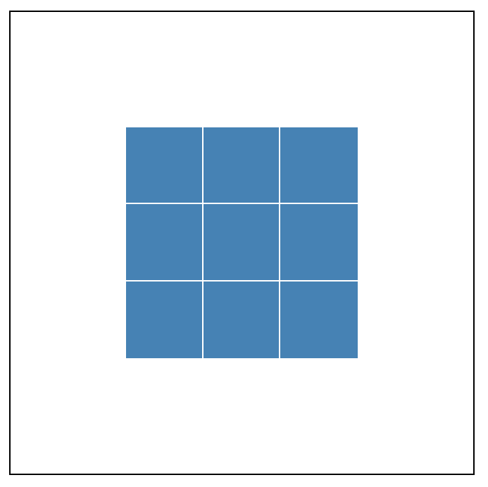

# HTML

## 视口标签

```html
<meta charset="utf-8" />
<title>菜鸟教程(runoob.com)</title>
<meta name="description" content="免费在线教程" />
<meta name="keywords" content="HTML,CSS,XML,JavaScript" />
<meta name="author" content="runoob" />
```

| 属性          | 描述                                                              |
| ------------- | ----------------------------------------------------------------- |
| width         | 设置视口宽度，可以设置为 device-width 设备宽度，标准 device-width |
| initial-scale | 初始缩放比，必须大于 0，标准 1.0                                  |
| maximum-scale | 最大缩放比，必须大于 0，标准 1.0                                  |
| minimum-scale | 最小缩放比，必须大于 0，标准 1.0                                  |
| user-scalable | 用户是否可以缩放，yes 或 no(1 或 0)，标准 0                       |

## 锚点定位

> 在指定标题标签里面添加`id="名字";`然后在超链接标签里面添加`href="#名字";`点击超链接即可跳指定位置

## 常用特殊符号

> 写完后必须加`;`

| 符号   | 字符    |
| ------ | ------- |
| 空格符 | &nbsp;  |
| ＞     | &gt     |
| ＜     | &lt     |
| &      | &amp    |
| ￥     | &yen    |
| ©      | &copy   |
| ®      | &reg    |
| °      | &deg    |
| ±      | &plusmn |
| ×      | &times  |
| ÷      | &divide |
| ²      | &sup2   |
| ³      | &sup    |

## 表单

### label 标签

> `label`的 for 绑定`input`的`id`能够点击`label`内的文字也能使`input`获取焦点
>
> 如果文字和`input`都存在于`label`，也能点击文字获取焦点

```html
<label for="male">男</label> <input type="radio" name="sex" id="male" />
```

### input 样式绑定

> `label`标签`for`绑定复选框`id`，`label`可控制复选框状态并自定义样式

```html
<label for="a"></label>
<input type="checkbox" id="a" />
```

| 属性 | 说明                                                                                                             |
| ---- | ---------------------------------------------------------------------------------------------------------------- |
| for  | 于绑定 input 里面的 id，可用于上面那个用法，前提是文字在 label 里，而 input 脱离了 label，点击文字就会触发 input |

### textarea 标签

> 输入大量的文字，用于评论，留言等

| 属性 | 说明         |
| ---- | ------------ |
| cols | 规定可见宽度 |
| rows | 规定可见行数 |

### select 标签

| 属性     | 说明       |
| -------- | ---------- |
| multiple | 多选，无值 |

#### 子标签 option

| 属性     | 说明       |
| -------- | ---------- |
| selected | 预选，无值 |

```html
可设置默认显示
<option disabled="disabled" value>请选择</option>
```

### form 标签

> 表单域，包住所有的表单，用于提交到服务器

| 属性    | 说明                                                                         |
| ------- | ---------------------------------------------------------------------------- |
| action  | 用于将数据提交到服务器，内容为服务器的 url 地址                              |
| method  | 提交方式                                                                     |
| name    | 规定表单名称                                                                 |
| enctype | 在发送到服务器之前应该如何对表单数据进行编码，multipart/form-data 为上传文件 |

# HTML5

## 语义化标签

| 标签    | 说明       |
| ------- | ---------- |
| header  | 头部标签   |
| nav     | 导航标签   |
| article | 内容标签   |
| section | 块级标签   |
| aside   | 侧边栏标签 |
| footer  | 尾部标签   |

## 多媒体标签

### 音频标签

```html
<audio>
  <source src="音频.ogg" type="audio/ogg" />
  <source src="音频.mp3" type="audio/mpeg" />
  您的浏览器版本太低，不支持此格式播放
</audio>
```

### 视频标签

```html
<video>
  <source src="视频.ogg" type="video/ogg" />
  <source src="视频.mp4" type="video/mp4" />
  您的浏览器版本太低，不支持此格式播放
</video>
```

### 属性

| 属性     | 说明                                                               |
| -------- | ------------------------------------------------------------------ |
| autoplay | 值 autoplay，自动播放                                              |
| controls | 值 controls，显示播放控件                                          |
| loop     | 值 loop，循环播放                                                  |
| src      | 文件路径                                                           |
| poster   | 如果不自动播放，则使用此属性添加视频封面路径                       |
| muted    | 值 muted，静音播放，添加此属性能解决谷歌浏览器不自动播放视频的问题 |

## 表单

| 属性          | 说明                        |
| ------------- | --------------------------- |
| type="url"    | 限制用户输入必须为 URL 类型 |
| type="date"   | 限制用户输入必须为日期类型  |
| type="time"   | 限制用户输入必须为时间类型  |
| type="month"  | 限制用户输入必须为月类型    |
| type="week"   | 限制用户输入必须为周类型    |
| type="number" | 限制用户输入必须为数字类型  |
| type="image"  | 图片提交按钮                |
| type="color"  | 生成一个颜色选择表单        |
| type="tel"    | 限制用户输入手机号类型      |

| 属性         | 说明                                                                                               |
| ------------ | :------------------------------------------------------------------------------------------------- |
| required     | 值即本身，提示用户表单不能为空                                                                     |
| autofocus    | 值即本身，页面加载完，自动聚焦指定表单                                                             |
| autocomplete | 值 off/on，输入内容提交后，会记入历史输入，下次输入会显示历史输入，前提需要有 name 属性，默认为 on |
| multiple     | 值即本身，用于多选文件上传                                                                         |
| min          | 最大值                                                                                             |
| max          | 最小值                                                                                             |
| accept       | 示例`accept=".png, .jpg"`，可让用户选择图片，但还是可以切换选择所有文件，验证就让`js`去做          |

# CSS

## 普通选择器

| 选择器 | 描述                                                                              |
| ------ | --------------------------------------------------------------------------------- |
| h1 + p | 兄弟选择器，选择`h1`紧挨着的下面的一个`p`元素，如果相隔一个元素将失效             |
| h1 ~ p | 同层全体组合选择器，选择所有跟在`h1`后的同层`p`元素，不管它们之间隔了多少其他元素 |
| h1.lyb | 单类选择器，选择类名为`lyb`的`h1`标签                                             |

## 属性选择器

> 如`div[class='lyb']`：匹配所有`class='lyb'`的 div 标签
>
> PS：`E[att="val"][att="vals"]`可连写，用于同时修改有`att="val"`的元素和有`att="vals"`属性的元素

| E 元素/att 属性/val 值 | 说明                                    |
| ---------------------- | --------------------------------------- |
| \*[att]                | 选择有 att 属性的所有元素               |
| E[att]                 | 选择有 att 属性的 E 元素                |
| E[att="val"]           | 选择有 att 属性且属性值=val 的 E 元素   |
| E[att^="val"]          | 匹配有 att 属性且值以 val 开头的 E 元素 |
| E[att$="val"]          | 匹配有 att 属性且值以 val 结尾的 E 元素 |
| E[att*="val"]          | 匹配有 att 属性且值含有 val 的 E 元素   |

## 结构伪类选择器

> 注：`n`可以是关键词：`even`偶数，`odd`奇数，可用于表格隔行变色；`n`可以是公式，`n`是从`0`开始依次加`1`的，如`2n`，则是偶数 2.4.6.8，`2n+1`则是奇数 1.3.5.7，`-n+m`则是选择前`m`个，`nth-last-child(-n+m)`则是选择后`m`个

| 匹配                                 | 说明                                                         |
| ------------------------------------ | ------------------------------------------------------------ |
| E:nth-child(n)                       | 匹配`E`标签或类名的第`n`个元素，非`E`将占用空间，且非`E`将无法匹配并修改样式 |
| E:not(:first-child)<br />E:not(.lyb) | 匹配除括号内的元素<br />注意匹配除`p`标签的`color`继承特性   |
| E:empty                              | 选择没有任何内容的元素，不包含有空格、换行符、注释、甚至已经定义了样式和伪元素 |
| :is(E1,E2,E3)                        | 批量同一样式<br />`:is(E1,E2,E3) a:hover` =`E1`、`E2`、`E3`的`a`鼠标悬浮<br />`:is(ol, ul) :is(ol, ul, menu, dir) :is(ul, menu, dir)`=`ol、ul`下面的`ol, ul, menu, dir`下面的`ul, menu, dir`标签<br />不支持伪元素<br />如果有一个优先级很高，则会带动其他优先级低的 |
| :where(E1,E2,E3)                     | 与`:is()`有同样的功能，但使用`where`设置的样式，权重为`0`，在任何地方都能被覆盖样式 |
| E:has(.box)                          | 匹配带有`.box`的`E`元素，但`Chrome`并不支持该属性            |
| E:focus                              | 输入框获取焦点后的样式                                       |

> 如果父盒子内有其他不相关的元素，建议使用以下

| 匹配             | 说明                                                         |
| ---------------- | ------------------------------------------------------------ |
| E:first-of-type  | 匹配所有E标签，如果E是类名，则匹配类名的标签名，然后获取     |
| E:last-of-type   | 最后一个                                                     |
| E:nth-of-type(n) | 匹配第`n`个`E`标签，如果`E`是类名，则匹配第`n`个同类同标签的元素<br />注：如果存在同类不同标签，会匹配第`n`个最后一种类别的标签 |

## 伪元素设置动态content

> 通过arr获取自定义属性值

```html
<style>
  .lyb::after {
    content: attr(data-name);
  }
</style>
<body>
  <div class="lyb" data-name="loading"></div>
</body>
<script>
  const el = document.querSelector('.lyb')
	el.dataset.percent = '冷弋白';
</script>
```

## 行内元素

| 标签   | 说明           |
| :----- | -------------- |
| a      | 定义超链接文本 |
| strong | 强调粗体文本   |
| b      | 定义粗体文本   |
| em     | 强调斜体文本   |
| i      | 定义斜体文本   |
| del    | 定义划掉文本   |
| ins    | 定义下划线文本 |
| u      | 定义下划线文本 |
| sub    | 定义下对齐     |
| sup    | 定义上对齐     |
| pre    | 保留空格和换行 |

## background

> 简写：背景色 背景图路径 背景平铺 背景位置 背景附着

### background-size

> 可填写像素、百分比，如果只填写一个，将默认等比拉伸宽度

| 属性值  | 说明                             |
| ------- | -------------------------------- |
| cover   | 等比拉伸铺满盒子                 |
| contain | 等比拉伸铺满高度或宽度将不再拉伸 |

### background-attachment

| 属性值 | 说明                     |
| ------ | ------------------------ |
| fixed  | 背景图片固定             |
| scroll | 背景图片随网页滚动而滚动 |

### background-position

> 底部对齐，向上移动`50px`，靠右对齐，向左移动`100px`

```css
background-position: bottom 50px right 100px;
```

## 宽高相等

```css
.lyb {
  width: 25vw;
  padding: 25vw 0 0;
}
```

## CSS样式表

### 获取样式表

```js
document.styleSheets; //css文件数组
document.styleSheets[0].rules; //css样式表，包含@Keyframe等
//可通过类型过滤出动画组
[...document.styleSheets[0].rules].filter(item => {
  return item instanceof CSSKeyframesRule;
})
```

### 插入样式表

```js
document.styleSheets[0].insertRule(
  `
  @keyframes rotate {
    0% {
      transform: rotate(180deg);
    }
    100% {
      transform: rotate(360deg);
    }
  }
  `,
  1 //代表插入索引位置，一般直接 document.styleSheets[0].length
);

document.querySelector('.lyb').style.animation = 'rotate 1s linear infinite'; //可直接使用
```

# CSS3

## 粘性定位

> 用于 tab 栏当滚动到浏览器页面顶端，将会固定
>
> 替代了通过滚动事件来设置
>
> 需要给该元素添加`top: 0`

```css
.tab-control {
  position: sticky;
  top: 0px;
}
```

## 过渡动画

> `transition`: 属性名称 时间 时间曲线 何时开始

| 属性                       | 描述     |
| :------------------------- | :------- |
| transition-property        | 名称     |
| transition-duration        | 时间     |
| transition-timing-function | 时间曲线 |
| transition-delay           | 何时开始 |

## 动画

> `animation`：名称 时间 速度曲线 何时开始 播放次数 是否倒放 是否保持最终位置
>
> PS：可设置多个动画的效果，用逗号隔开，如`animation：a 1s, b 1s;`

| 属性值                    | 说明                                                              |
| ------------------------- | ----------------------------------------------------------------- |
| animation-name            | 名称                                                              |
| animation-duration        | 周期时间                                                          |
| animation-timing-function | 速度曲线                                                          |
| animation-delay           | 何时开始                                                          |
| animation-iteration-count | 次数，`infinite`无限循环                                          |
| animation-direction       | 动画是否倒放，默认`normal`，`alternate`倒放                       |
| animation-play-state      | 动画暂停，默认是`running`，还有`paused，`用于鼠标来触发           |
| animation-fill-mode       | 动画结束后状态，保持最后位置`forwards`，默认为回到起始`backwards` |

## 3D

| 属性               | 说明                                                         |
| ------------------ | ------------------------------------------------------------ |
| perspective-origin | 透视观察位置，默认`center`，填入`x`轴和`y`轴，单位可为像素及百分比，填一个值为`x`轴 |

## 倒影

> `-webkit-box-reflect: below -10px linear-gradient(transparent, transparent 0%, rgba(0, 0, 0, 0.25));`

| 属性值   | 说明                                                                                                                                  |
| :------- | ------------------------------------------------------------------------------------------------------------------------------------- |
| 倒影位置 | `above`：指定倒影在对象的上边<br />`below`：指定倒影在对象的下边<br />`left`：指定倒影在对象的左边<br />`right`：指定倒影在对象的右边 |
| 倒影距离 | 像素，可使用百分比                                                                                                                    |
| 遮罩层   | 一般为上面的线性渐变                                                                                                                  |

## 滤镜

> `backdrop-filter`只对下一层的元素生效，如`blur`毛玻璃

| 属性值          | 说明                             |
| --------------- | -------------------------------- |
| blur(px)        | 模糊度                           |
| brightness(%)   | 亮度                             |
| contrast(%)     | 对比度                           |
| drop-shadow     | 与普通阴影不同的是它不会忽略透明 |
| grayscale(%)    | 灰度图像                         |
| hue-rotate(deg) | 色相旋转选择                     |
| invert(%)       | 颜色反转                         |
| saturate(%)     | 饱和度                           |
| sepia(%)        | 褐色                             |

## 混合模式

> `mix-blend-mode`：（常用的一般是`soft-light`，`overlay`）
>
> 给文字设置`difference`可根据背景色改变颜色

| 混合方式    | 说明     |
| ----------- | -------- |
| normal      | 正常     |
| multiply    | 正片叠底 |
| screen      | 滤色     |
| overlay     | 叠加     |
| darken      | 变暗     |
| lighten     | 变亮     |
| color-dodge | 颜色减淡 |
| color-burn  | 颜色加深 |
| hard-light  | 强光     |
| soft-light  | 柔光     |
| difference  | 差值     |
| exclusion   | 排除     |
| hue         | 色相     |
| saturation  | 饱和度   |
| color       | 颜色     |
| luminosity  | 亮度     |

# CSS 变量

## 变量存放

### 全局

```CSS
:root{
    --lyb:pink;
}
div{
    color:var(--lyb);
}
```

### 局部

```css
div {
  --lyb: 10px;
  width: calc(var(--lyb) * 10);
  height: calc(var(--lyb) * 20);
}
```

## 修改变量

```js
let root = document.querySelector(":root");
root.style.setProperty("--lyb", "100px");
```

## 运用在动画

```html
<style>
  div {
    animation-delay: calc(0.46s * var(--a));
  }
</style>
<body>
  <div style="--a:1"></div>
  <div style="--a:2"></div>
  <div style="--a:3"></div>
  <div style="--a:4"></div>
  <div style="--a:5"></div>
</body>
```

## calc函数

> 子盒子永远比父盒子小 100px：`width:calc(100% - 100px);`

## clamp函数

> 设置最大、最小区间

```css
.test {
  /* 最小50px 当前10vw 最大250px */
  font-size: clamp(50px, 10vw, 250px);
}
```

# CSS 技术

## 精灵图

> 释义：一张宽 24px，高 72px 的精灵图，里面的图标都是 24×24 的，-48px 表示从精灵图 48px 的位置开始，选取下面 24px 高的图标，所以整张整张精灵图有 48+24=72px 高

```css
a,
b,
c {
  width: 24px;
  height: 24px;
  background: url() no-repeat;
}
a {
  background-position: 0 0;
}
b {
  background-position: 0 -24px;
}
c {
  background-position: 0 -48px;
}
```

> 使用 JS 快速生成

```js
let lis = document.querySelectorAll("li");
for (let i = 0; i < lis.length; i++) {
  let index = i * 44;
  lis[i].style.backgroundPosition = "0 -" + index + "px";
}
```

## 制作三角形

```css
div {
  width: 100px;
  height: 100px;
  border-style: solid;
  border-width: 50px;
  box-sizing: border-box;
  border-color: red yellow green blue;
}
```

<div style="width: 200px;
    height: 200px;
    border-style: solid;
    border-width: 100px;
    box-sizing: border-box;
    border-color: red yellow green blue;">
</div>

## 网页图标

```html
<head>
  <link rel="shortcut icon" href="favicon.ico" type="image/x-icon" />
  <!--  转为ico格式：www.bitbug.net -->
</head>
```

## 合并盒子边框线

> 如果想做好几个盒子边框线，但又想让它们的边框线合并，看着没那么厚，则可以使用`margin-left:-(border的厚度)`
>
> 当有两行盒子，让它们上下边框合并则使用`margin-top:-(border的厚度)`
>
> 但想给它们加 hover 悬浮盒子后改变边框颜色，却会被右边的盒子压住右边框线，则只需要在盒子里面加入`z-index`层级就行了

# CSS 额外笔记

## 文本相关整合

| 属性名                         | 说明                                                        |
| ------------------------------ | ----------------------------------------------------------- |
| text-indent                    | 首行缩进，2em 表示两个汉字的距离                            |
| letter-spacing                 | 字符间距，px 为单位                                         |
| word-spacing                   | 单词间距                                                    |
| word-break:break-all           | 文字换行                                                    |
| white-space: nowrap            | 文字不换行，直到遇到 `<br/>`标为止                          |
| writing-mode: vertical-lr      | 文字从上到下从左到右排列                                    |
| -webkit-text-stroke: 宽度 颜色 | 文字描边                                                    |
| user-select: none              | 禁止选中文字                                                |
| touch-action: none             | 禁止移动端滑动屏幕及放大缩小一切操作                        |
| line-height: 1                 | 文字自带行高影响布局，设为 1 可清除默认行高，2 则相距一个字 |

## 大小写转换

**text-transform**

| 属性值     | 说明               |
| ---------- | ------------------ |
| none       | 还原               |
| uppercase  | 所有字母转为大写   |
| lowercase  | 所有字母转为小写   |
| capitalize | 每个单词首字母大写 |

## CSS 点击

**first:target**

> 只能使用超链接点击，链接设置为盒子的#first，给需要改变的盒子添加`id="first"`

```html
<style>
  #lyb {
    width: 300px;
    height: 300px;
    background: #ccc;
  }
  #lyb:target {
    background-color: red;
  }
</style>
<body>
  <a href="#lyb">点我</a>
  <div id="lyb"></div>
</body>
```

## 冷门样式修改

### 输入框描述

```css
input::-webkit-input-placeholder {
  color: #ccc;
  font-size: 12px;
}
```

### 输入框光标颜色

```css
input {
  caret-color: red;
}
```

###  删除 `type="number"` 末尾的箭头

```css
.no-arrow::-webkit-outer-spin-button,
.no-arrow::-webkit-inner-spin-button {
  -webkit-appearance: none;
}
```

# 其他整合

| 属性名                                      | 说明                                                         |
| ------------------------------------------- | ------------------------------------------------------------ |
| @dragstart.prevent                          | Vue阻止拖拽                                                  |
| tap-highlight-color: transparent            | 解决移动端点击出现蓝色背景                                   |
| pointer-events: none                        | 鼠标穿透，auto 还原                                          |
| flex-shrink: 0;                             | 解决开启 flex 后，子盒子正常宽度无法撑开盒子的问题           |
| resize: both;                               | 使用此属性需要加overflow: hidden                             |
| scroll-behavior: smooth;                    | 平滑滚动                                                     |
| overscroll-behavior: contain;               | 阻止在子盒子内滚动到底部后继续滚动会带动父盒子滚动           |
| overflow-anchor:auto;                       | 解决当滚动到一定位置，上面的图片加载完成了，会直接把当前位置的内容给推下去 |
| scroll-snap-type: y proximity \| mandatory; | 滚动贴合，需要设置宽高以及`overflow: auto`，给子元素设置：`     style="scroll-snap-align: start"` |

# 布局

## 媒体查询

> 需要写在被修改样式的下面，否则将会因为权重问题而无法修改，如果加`!important`又显得比较多余

```html
<!DOCTYPE html>
<html lang="en">
  <head>
    <meta charset="UTF-8" />
    <meta
      name="viewport"
      content="width=device-width, initial-scale=1.0, maximum-scale=1.0, user-scalable=0"
    />
    <meta http-equiv="X-UA-Compatible" content="ie=edge" />
    <title>冷弋白的网页</title>
    <style>
      * {
        margin: 0;
        padding: 0;
        transition: all 0.25s ease-out;
      }

      .container {
        height: 150px;
        background-color: pink;
        margin: 0 auto;
      }

      @media screen and (max-width: 1440px) {
      }

      @media screen and (max-width: 1024px) {
      }

      @media screen and (max-width: 768px) {
      }

      @media screen and (max-width: 425px) {
      }
    </style>
  </head>

  <body>
    <!-- JS -->
    <script></script>
  </body>
</html>
```

## grid 布局

### 父盒子属性

| 属性                            | 值                                                           | 解释                                                         |
| ------------------------------- | ------------------------------------------------------------ | ------------------------------------------------------------ |
| ①grid-template-columns          | 值 1：100px 100px 100px<br />值 2：repeat(3,100px)<br />值 3：repeat(auto-fill,100px)<br />值 4：1fr 2fr 3fr<br />值 5：repeat(4,1fr)<br />值 6：1fr minmax(150px，1fr)<br />值 7：100px auto 100px | 值 1&2：三列，每列 100px<br />值 3：列数随着父盒子宽度改变而改变<br />值 4：三列，宽度分配比例 1:2:3<br />值 5：四列，宽度等比分配<br />值 6：第一列宽度自动分配，第二列最小 150px，最大 1fr<br />值 7：左右 100px，中间自动分配，1fr 有同样的效果 |
| ②grid-template-rows             |                                                              | 与①一样，但是纵向                                            |
| ~~③column-gap~~                 | ~~-~~                                                        | ~~每列格子之间的间距~~                                       |
| ~~④row-gap~~                    | ~~-~~                                                        | ~~每行格子之间的间距~~                                       |
| ⑤gap (3 和 4 的简写)            | -                                                            | -                                                            |
| ⑦grid-auto-flow                 | 值 1：row dense                                              | 与flex-direction相当<br />值 1：换行时如果有空的地方，下面的盒子会填充上来 |
| ⑧justify-items                  | start \| end \| center                                       | 子盒子水平排列方式，需要子盒子小于 grid 格子宽高才会生效     |
| ⑨align-items                    | start \| end \| center                                       | 子盒子垂直排列方式，需要子盒子小于 grid 格子宽高才会生效     |
| ⑩place-items(8 和 9 的简写)     | -                                                            | -                                                            |
| ⑪justify-content                | 和 flex 布局一样                                             | 所有子盒子整体水平布局                                       |
| ⑫align-content                  | 和 flex 布局一样                                             | 所有子盒子整体垂直布局                                       |
| ⑬place-content(11 和 12 的简写) | -                                                            | -                                                            |
| ⑭grid-auto-columns              | 不常用                                                       |                                                              |
| ⑮grid-auto-rows                 | 不常用                                                       |                                                              |

### 单个子盒子属性

| 属性                            | 值                     | 描述                           |
| ------------------------------- | ---------------------- | ------------------------------ |
| ①grid-column-start              | 1                      | 从横向第一个的左边那条线开始   |
| ②grid-column-end                | 3                      | 从横向第三条线结束，共占用两格 |
| ③grid-row-start                 | 1                      | 从纵向第一个的左边那条线开始   |
| ④grid-row-end                   | 3                      | 从纵向第三条线结束，共占用两格 |
| ⑤grid-column(1 和 2 的简写形式) | -                      | -                              |
| ⑥grid-row(3 和 4 的简写形式)    | -                      | -                              |
| ⑦grid-area                      | 1 / 1 / 3 / 3          | 以上四个的简写，占用 2×2 格    |
| ⑧justify-self                   | start \| end \| center | 跟 justify-items 用法一致      |
| ⑨align-self                     | start \| end \| center | 跟 align-items 用法一致        |
| ⑩place-self (8 和 9 的简写形式) | -                      | -                              |

## 简单教程

### grid-template-columns

> grid 自身就是一个类似 flex 的盒子
>
> `grid-template-columns: 50px 50px 50px;`
>
> `grid-template-rows: 50px 50px 50px;`
>
> 这两个属性将 grid 分成了 9\*9 的空间，每个空间 50px，空间也撑开了 grid

```html
<head>
  <style>
    * {
      margin: 0;
      padding: 0;
    }

    body {
      height: 100vh;
      display: flex;
      flex-flow: column wrap;
      justify-content: center;
      align-items: center;
      background-color: rgb(255, 255, 255);
    }

    .grid {
      display: grid;
      grid-template-columns: 50px 50px 50px;
      grid-template-rows: 50px 50px 50px;
      outline: 1px solid rgb(0, 0, 0);
    }
    /*
        .a {
            width: 100%;
            height: 100%;
            background-color: steelblue;
            outline: 1px solid rgb(255, 255, 255);
        }*/
  </style>
</head>

<body>
  <div class="grid">
    <!--
        <div class="a"></div>
        <div class="a"></div>
        <div class="a"></div>
        <div class="a"></div>
        <div class="a"></div>
        <div class="a"></div>
        <div class="a"></div>
        <div class="a"></div>
        <div class="a"></div> -->
  </div>
</body>
```


_这张图是浏览器开发者工具选中它所呈现的虚线和淡蓝色背景，实际上是空白_

> 当我们解开注释，类名为 a 的元素宽高由于是 100%，所以填满了空间


### 父盒子固定宽高

> 我们现在给 grid 盒子设置宽高为 300px，并将下列两个属性原来 50px 的值设置为 1fr
>
> 1fr 相当于是 flex 布局中，子项的 flex，它将自动分配空间来填充 grid
>
> `grid-template-columns：1fr 1fr 1fr;`
>
> `grid-template-rows：1fr 1fr 1fr;`


> 还是上面的设置，我们将类名为 a 的元素的宽高都设为 50px
>
> 事实上每个元素存在于每个 grid 格子内，每个元素的初始位置即左上角


### justify/align-items

> 我们再给 grid 加上
>
> `align-items: center;`
>
> `justify-items: center;`
>
> 里面的每个元素就水平垂直居中了，既然 items 是控制元素的，那还有一个 content 是控制主体的


> 现在我们再将 grid 和类名为 a 的元素的几个属性设置为如下
>
> grid 的
>
> `grid-template-columns: 50px 50px 50px;`
>
> `grid-template-rows: 50px 50px 50px;`
>
> `align-content: center;`
>
> `justify-content: center;`
>
> 类名为 a 的元素的
>
> `width: 100%;`
>
> `height: 100%;`
>
> 由于我们给 grid 设置了宽高，又将 grid-template-columns 和 grid-template-rows 的属性换成固定值，固定值总和小于父盒子宽高，此时那 9 个存放元素的空间就挤在了初始位置左上角，由此我们可以使用 align-content 和 justify-content 来控制这 9 个空间整体在 grid 的位置为水平垂直居中



> 我们可以设置 column-gap 和 row-gap 控制每个空间的间隔
>
> `row-gap: 10px;`
>
> `column-gap: 30px;`
>
> 也可以使用 gap
>
> `gap: 10px 30px;`


> 此时将 justify-content 和 align-content 的属性值修改成 space-between 能呈现另一种排列方式


### grid-template-areas

> 可以使用 grid-template-areas 来定义模板，如下

```html
<head>
  <style>
    * {
      margin: 0;
      padding: 0;
    }

    body {
      height: 100vh;
      display: flex;
      flex-flow: column wrap;
      justify-content: center;
      align-items: center;
    }

    .grid {
      width: 250px;
      display: grid;
      grid-gap: 7px;
      grid-template-areas:
        "h h h"
        "i j j"
        "k k k";
    }

    .a,
    .b,
    .c,
    .d {
      border-radius: 3px;
    }

    .a {
      height: 50px;
      background-color: #ea707a;
      grid-area: h;
    }

    .b {
      height: 200px;
      background-color: #fdc25b;
      grid-area: i;
    }

    .c {
      height: 200px;
      background-color: #69c9f9;
      grid-area: j;
    }

    .d {
      height: 50px;
      background-color: #6cd58b;
      grid-area: k;
    }
  </style>
</head>

<body>
  <div class="grid">
    <div class="a"></div>
    <div class="b"></div>
    <div class="c"></div>
    <div class="d"></div>
  </div>
</body>
```


